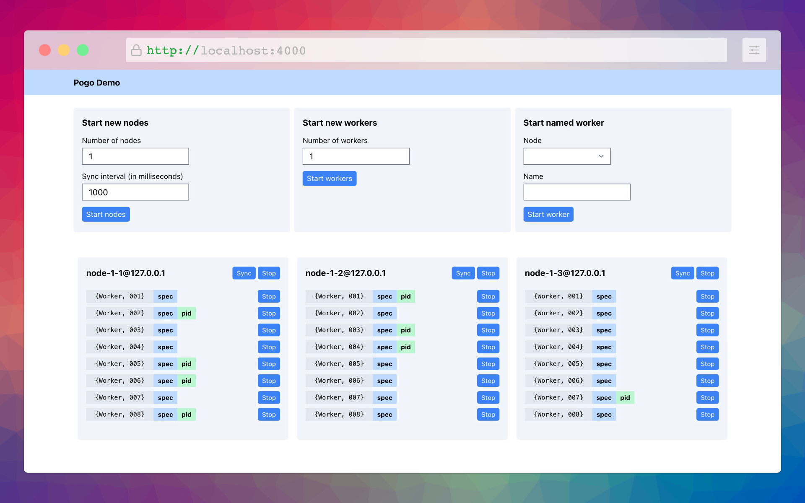

# PogoDemo

Demo of [pogo](https://github.com/team-telnyx/pogo) library, a distributed supervisor for Elixir.

To start:

  * Run `mix setup` to install and setup dependencies
  * Start Phoenix endpoint with `mix phx.server` or inside IEx with `iex -S mix phx.server`

Now you can visit [`localhost:4000`](http://localhost:4000) from your browser.
